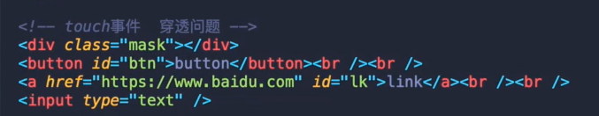

# 移动端touch事件
1. touch事件也有event，event的type为事件的类型（start，move，end，cancel）。event.target为当前元素。但是要注意的是move与end的target目标元素为触发start的时候的元素
2. touch事件的touches保存了当前触点的个数及其位置信息等（值为数组）
3. touch事件的穿透问题
   - 场景：当有蒙层的时候，蒙层为渲染节点的最外层的兄弟节点，触发touchstart事件后，由于移动端的300ms的延迟，会导致300ms之后触发button的onclick事件、ab标签的跳转的、input的focus事件等
    
   - 解决办法

     1. 封装tap事件，阻止掉事件的默认行为 e.preventDefault()
     2. 引入fastChlick 